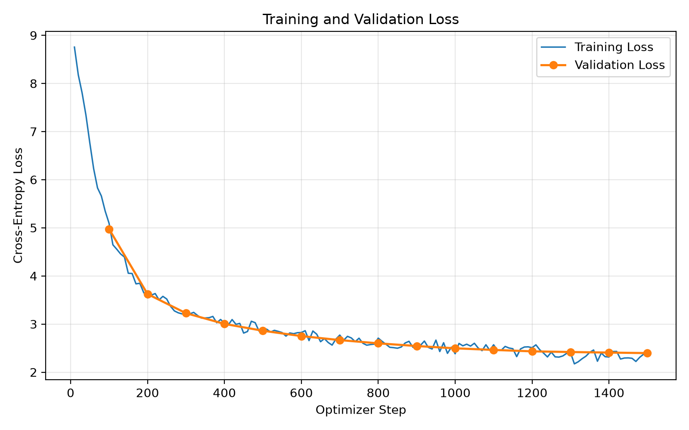
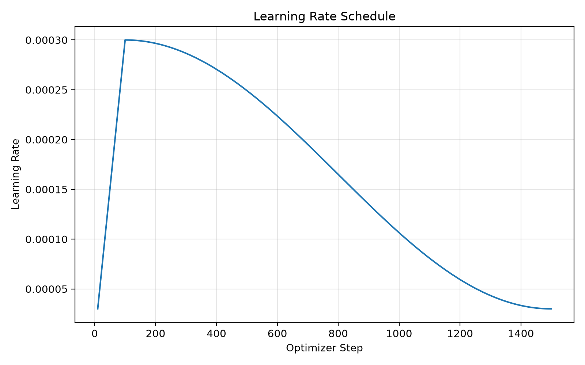

# LLM from Scratch


A decoder-only Transformer language model implemented and pretrained from scratch in PyTorch.

This project covers the complete language-modeling pipeline, including Transformer architecture implementation, byte-level BPE tokenization, causal language-model pretraining, autoregressive generation, and evaluation.

The final model contains **13.77M parameters** and was pretrained on **TinyStories** using a custom **8K BPE tokenizer**.

## Highlights

- Implemented a decoder-only Transformer from scratch in PyTorch
- RMSNorm and Pre-Norm residual architecture
- Rotary Position Embeddings (RoPE)
- Multi-head causal self-attention
- SwiGLU feed-forward networks
- Weight tying between token embeddings and the language-modeling head
- Custom byte-level BPE tokenizer trained from scratch
- Memory-mapped dataset pipeline for efficient token loading
- Mixed-precision training with gradient clipping
- Linear warmup + cosine learning-rate decay
- Checkpointing and validation evaluation
- Greedy, temperature, and top-k autoregressive decoding
- End-of-sequence stopping
- Training and validation visualization

---

## Architecture

The model follows a modern decoder-only Transformer architecture:

```text
Token IDs
   │
   ▼
Token Embedding
   │
   ▼
┌───────────────────────────────┐
│ Transformer Block × 6         │
│                               │
│ RMSNorm                       │
│    │                          │
│    ▼                          │
│ Causal Multi-Head Attention   │
│ + RoPE                        │
│    │                          │
│ Residual Connection           │
│    │                          │
│ RMSNorm                       │
│    │                          │
│ SwiGLU MLP                    │
│    │                          │
│ Residual Connection           │
└───────────────────────────────┘
   │
   ▼
Final RMSNorm
   │
   ▼
Language Modeling Head
   │
   ▼
Next-token Logits
```
### Model Configuration

| Component | Value |
|---|---:|
| Parameters | 13.77M |
| Vocabulary size | 8,192 |
| Context length | 256 |
| Transformer layers | 6 |
| Hidden dimension | 384 |
| Attention heads | 6 |
| Head dimension | 64 |
| FFN dimension | 1,024 |
| Normalization | RMSNorm |
| Position encoding | RoPE |
| MLP | SwiGLU |
| Architecture | Decoder-only, Pre-Norm |

## Core Components

### RMSNorm

The model uses RMSNorm instead of LayerNorm. RMSNorm normalizes hidden states using their root mean square while avoiding explicit mean centering.

$$
\mathrm{RMSNorm}(x)=\gamma\frac{x}{\sqrt{\frac{1}{d}\sum_{i=1}^{d}x_i^2+\epsilon}}
$$

RMSNorm is applied in a Pre-Norm configuration before both the attention and feed-forward sublayers.
### Rotary Position Embeddings

Rotary Position Embeddings (RoPE) are applied to the query and key vectors before computing attention scores.

For token positions $m$ and $n$:

$$
q_m = R(m\theta)q,\qquad k_n = R(n\theta)k
$$

The resulting attention interaction can be written as:

$$
q_m^\top k_n = q^\top R((n-m)\theta)k
$$

so relative positional information is naturally encoded in the attention score.

### Causal Multi-Head Self-Attention

The attention module uses a causal mask so that each token can only attend to itself and previous tokens.

$$
\mathrm{Attention}(Q,K,V)
=
\mathrm{softmax}
\left(
\frac{QK^\top}{\sqrt{d_h}} + M
\right)V
$$

where $M$ masks all future positions.

### SwiGLU

The feed-forward network uses a SwiGLU activation:

$$
\mathrm{SwiGLU}(x)
=
\mathrm{SiLU}(xW_g)\odot(xW_u)
$$

followed by a projection back to the hidden dimension.

### Weight Tying

The token embedding matrix and language-modeling output projection share the same weights, reducing the total parameter count and following a common language-modeling design.

## Tokenizer

A byte-level BPE tokenizer was trained from scratch on the TinyStories corpus.

### Configuration

- Tokenizer type: Byte-level BPE
- Vocabulary size: **8,192**
- Special tokens: `<unk>`, `<eos>`
- Byte-level pre-tokenization
- Byte-level decoder
- Minimum token frequency: 2

### Example

Input:

```text
Once upon a time, a little girl found a beautiful red flower.
```
Tokenized output:

```text
['Once', 'Ġupon', 'Ġa', 'Ġtime', ',', 'Ġa', 'Ġlittle',
 'Ġgirl', 'Ġfound', 'Ġa', 'Ġbeautiful', 'Ġred',
 'Ġflower', '.']
 ```
 
 This sentence contains **61 UTF-8 bytes** but is represented using only **14 BPE tokens**.
The tokenizer is trained independently before language-model pretraining and saved as a reusable tokenizer artifact.

## Data Pipeline

The TinyStories corpus is pre-tokenized before training and stored as compact binary token streams.

```text
TinyStories
     │
     ▼
Custom BPE Tokenizer
     │
     ▼
Token IDs
     │
     ▼
uint16 Binary Files
     │
     ▼
NumPy Memmap
     │
     ▼
PyTorch Dataset
     │
     ▼
DataLoader
```
### Preprocessing

Each story is encoded using the custom BPE tokenizer and terminated with an `<eos>` token.

The resulting token IDs are stored as `uint16` binary files:

```text
artifacts/data/
├── train.bin
└── val.bin
```
Since the vocabulary contains only 8,192 tokens, `uint16` is sufficient to represent every token ID while keeping the dataset compact.

### Memory-Mapped Dataset

Training data is accessed using `numpy.memmap` rather than loading the entire token corpus into memory.

For a sequence length of 256, the causal language-modeling dataset constructs:

```text
Input:
[x0, x1, x2, ..., x255]

Target:
[x1, x2, x3, ..., x256]
```

so the model learns to predict the next token at every position.

Pre-tokenizing the corpus avoids repeated tokenization during training and provides efficient random access to the binary token stream.

## Pretraining

The model was pretrained on TinyStories using causal language modeling with next-token prediction.

### Training Configuration

| Setting | Value |
|---|---:|
| Training tokens | 5,000,000 |
| Validation tokens | 250,000 |
| Batch size | 32 |
| Sequence length | 256 |
| Tokens per optimizer step | 8,192 |
| Optimizer steps | 1,500 |
| Total token exposures | 12.288M |
| Optimizer | AdamW |
| Peak learning rate | 3e-4 |
| Minimum learning rate | 3e-5 |
| Warmup steps | 100 |
| Learning-rate schedule | Linear Warmup + Cosine Decay |
| Mixed precision | FP16 |
| Gradient clipping | 1.0 |

### Training Objective

For each input sequence, the model predicts the next token at every position using causal language modeling.

The training objective is the token-level cross-entropy loss:

$$
\mathcal{L}
=
-\frac{1}{N}
\sum_{i=1}^{N}
\log p(x_i \mid x_{<i})
$$

The logits are passed directly to PyTorch cross entropy without applying softmax explicitly, since the loss function internally performs the required log-softmax computation.

### Optimization

The learning rate uses a linear warmup during the first 100 optimizer steps, increasing from zero to a peak learning rate of $3\times10^{-4}$.

After warmup, the learning rate follows cosine decay toward a minimum value of $3\times10^{-5}$.

Mixed-precision training is used on CUDA to reduce memory usage and improve training throughput. Gradients are unscaled before applying gradient-norm clipping.

## Training Results

The model showed stable optimization throughout pretraining, with validation loss consistently decreasing over the full 1,500-step run.

### Validation Loss

| Step | Validation Loss |
|---:|---:|
| 100 | 4.9747 |
| 500 | 2.8606 |
| 1,000 | 2.4956 |
| 1,500 | **2.3963** |

The final validation perplexity is:

$$
\mathrm{PPL}
=
\exp(2.3963)
\approx
10.98
$$

The validation loss continued to improve through the final checkpoint, with no clear sign of overfitting during this training run.

### Loss Curves



The training loss shows the expected batch-level fluctuations, while the validation loss follows a smoother and consistently decreasing trend.

### Learning Rate Schedule



The scheduler performs a linear warmup to the peak learning rate, followed by cosine decay toward the minimum learning rate.

## Autoregressive Generation

The model supports autoregressive text generation using multiple decoding strategies:

- Greedy decoding
- Temperature sampling
- Top-k sampling
- End-of-sequence stopping
- Context-window truncation

For temperature-based sampling, the next-token distribution is computed as:

$$
p_i
=
\mathrm{softmax}
\left(
\frac{z_i}{T}
\right)
$$

where $T$ controls the sharpness of the probability distribution.

### Example Prompt

```text
Once upon a time, there was a little girl named Lily who
```
### Greedy Decoding

```text
Once upon a time, there was a little girl named Lily who loved
to play with her toys. One day, she went to the park with her
mommy and saw a big slide...
```
Greedy decoding produced locally coherent text but frequently fell into repetitive high-probability patterns.

### Temperature = 0.7, Top-k = 50
```text
Once upon a time, there was a little girl named Lily who loved
to draw. One day, she went to the beach to get a little bit of
the water...
```
Among the tested decoding settings, this configuration provided the best balance between coherence and diversity.

### Decoding Comparison

| Strategy | Observation |
|---|---|
| Greedy | Coherent but repetitive |
| Temperature 0.7 + Top-k 50 | Best coherence-diversity balance |
| Temperature 1.0 + Top-k 50 | More diverse, but weaker logical consistency |
| Temperature 1.3 + Top-k 50 | Unstable and prone to premature EOS |

The experiments show that decoding strategy has a significant effect on generation quality, even when the underlying model parameters remain unchanged.

Complete generation samples are available in:
```text
artifacts/generation_samples.md
```

## Project Structure

```text
llm-from-scratch/
├── artifacts/
│   ├── figures/
│   │   ├── learning_rate.png
│   │   ├── loss_curves.png
│   │   ├── train_loss.png
│   │   └── validation_loss.png
│   ├── tokenizer/
│   │   └── tinystories_bpe_8k.json
│   ├── generation_samples.md
│   └── results.md
│
├── configs/
│
├── scripts/
│   ├── benchmark_batch.py
│   ├── generate.py
│   ├── plot_training.py
│   ├── prepare_data.py
│   ├── smoke_test.py
│   ├── train.py
│   └── train_tokenizer.py
│
├── src/
│   └── llm/
│       ├── config.py
│       ├── generation.py
│       │
│       ├── data/
│       │   ├── bpe_tokenizer.py
│       │   ├── dataset.py
│       │   └── tokenizer.py
│       │
│       ├── model/
│       │   ├── attention.py
│       │   ├── block.py
│       │   ├── gpt.py
│       │   ├── mlp.py
│       │   ├── norm.py
│       │   └── rope.py
│       │
│       └── training/
│           └── trainer.py
│
├── tests/
│   ├── test_attention.py
│   ├── test_block.py
│   ├── test_dataset.py
│   ├── test_generation.py
│   ├── test_gpt.py
│   ├── test_mlp.py
│   ├── test_norm.py
│   └── test_rope.py
│
├── .gitignore
├── pyproject.toml
└── README.md
```
The project separates model components, data processing, training utilities, experiment scripts, and tests to keep the implementation modular and easy to extend.

## Installation

Python 3.12 was used for development.

Clone the repository:

```bash
git clone https://github.com/YOUR_USERNAME/llm-from-scratch.git
cd llm-from-scratch
```
Create and activate a virtual environment.
### Windows
```bash
python -m venv .venv
.venv\Scripts\activate
```
### macOS / Linux
```bash
python -m venv .venv
source .venv/bin/activate
```
Install the project and development dependencies:
```bash
pip install -e ".[dev]"
```
For GPU training, install a CUDA-enabled PyTorch build compatible with your local CUDA environment before running the training scripts.

## Usage

### 1. Train the BPE Tokenizer

Train the custom byte-level BPE tokenizer on TinyStories:

```bash
python scripts/train_tokenizer.py
```
The trained tokenizer is saved to:
```text
artifacts/tokenizer/tinystories_bpe_8k.json
```
### 2. Prepare the Dataset
Tokenize the TinyStories corpus and write the token streams to binary files:
```bash
python scripts/prepare_data.py
```
This creates:
```text
artifacts/data/
├── train.bin
└── val.bin
```
The binary dataset files are excluded from Git because they are generated artifacts.

### 3. Benchmark Batch Size
Before full pretraining, benchmark GPU memory usage for different batch sizes:
```bash
python scripts/benchmark_batch.py
```
This can be used to select a suitable training batch size for the available GPU memory.
### 4. Pretrain the Model
Start causal language-model pretraining:
```bash
python scripts/train.py
```
Checkpoints are saved under:
```text
outputs/checkpoints/
```
The checkpoint directory is excluded from Git.
### 5. Generate Text
Run autoregressive generation using the trained checkpoint:
```bash
python scripts/generate.py
```
The generation script compares multiple decoding strategies, including greedy decoding and temperature-based top-k sampling.
### 6. Plot Training Metrics
Generate training and validation loss curves together with the learning-rate schedule:
```bash
python scripts/plot_training.py
```
Figures are saved under:
```text
artifacts/figures/
```
### 7. Run Tests
Run the full test suite:
```bash
pytest -v
```
## Implementation Notes

The core language-modeling components in this project are implemented explicitly in PyTorch rather than relying on high-level Transformer model classes.

Key components implemented from scratch include:

- RMSNorm
- Rotary Position Embeddings (RoPE)
- Query, key, and value projections
- Multi-head causal self-attention
- Causal masking
- SwiGLU feed-forward networks
- Pre-Norm residual Transformer blocks
- Token embedding and language-modeling head
- Weight tying
- Causal language-model cross-entropy loss
- Gradient accumulation
- Mixed-precision training
- Gradient clipping
- Linear warmup and cosine learning-rate scheduling
- Checkpoint saving
- Autoregressive decoding
- Temperature sampling
- Top-k sampling
- EOS-based generation stopping

The tokenizer training and dataset preprocessing pipeline are also implemented as separate stages so that tokenization is completed before model pretraining.

High-level libraries are used only where appropriate for supporting tasks such as dataset access and BPE tokenizer training. The Transformer architecture, training loop, and generation logic remain explicitly implemented in PyTorch.

## Limitations

The model is intentionally small and trained on a limited corpus, so several limitations remain:

- Greedy decoding tends to produce repetitive high-probability patterns
- Long-range entity consistency is limited
- Longer generations may contain logical inconsistencies
- Generation quality is sensitive to sampling temperature
- Higher temperatures can lead to unstable outputs or premature EOS generation
- The current generation implementation does not use a KV cache
- The context length is limited to 256 tokens
- The pretraining corpus and token budget are relatively small compared with modern large language models

These limitations are expected for a 13.77M-parameter model trained on a modest token budget and provide useful insight into the effects of model capacity, training scale, and decoding strategy.

## Future Work

Several extensions could further improve the efficiency, scalability, and generation quality of the project:

- Add KV-cache support for faster autoregressive generation
- Use PyTorch scaled dot-product attention or Flash Attention for more efficient training
- Add nucleus (top-p) sampling as an additional decoding strategy
- Increase the pretraining corpus and total token budget
- Experiment with larger model configurations
- Add gradient checkpointing for memory-efficient training
- Support configuration files for easier model and training experiments
- Conduct systematic scaling experiments across model size, dataset size, and training compute

These extensions would make it possible to study how architectural choices, training scale, and decoding strategies affect language-model performance beyond the current 13.77M-parameter setup.

## Acknowledgements

This project uses the TinyStories dataset for tokenizer training and language-model pretraining.

The implementation is built with PyTorch, while Hugging Face `datasets` and `tokenizers` are used for dataset access and byte-level BPE tokenizer training.

The Transformer architecture, training loop, evaluation pipeline, and autoregressive generation logic are implemented explicitly as part of this project.